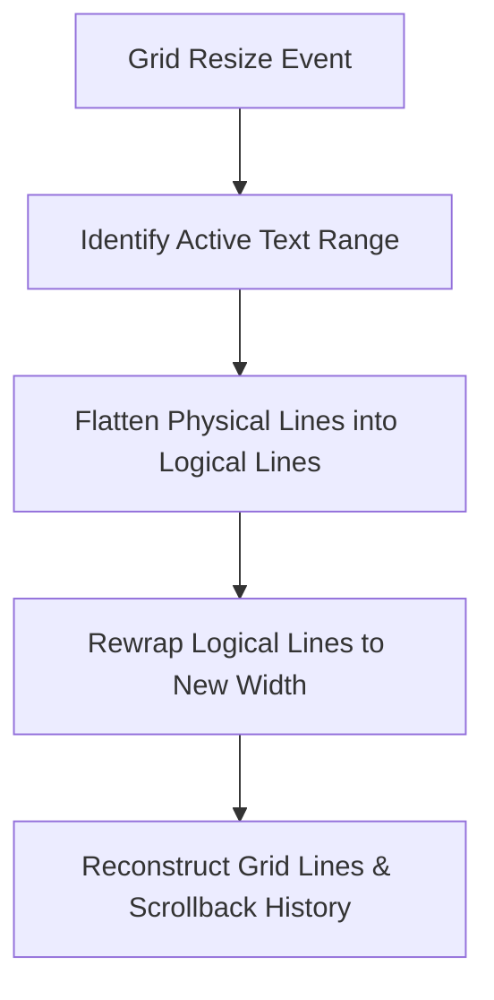

# Text Reflow in szn

This document explains the design, algorithms, and engineering implementation of the **Text Reflow** system in `szn`.

---

## 1. Overview

When a terminal pane is resized (e.g., when the user drags the mouse or splits the screen), standard terminal behavior simply truncates or pads lines with trailing spaces. `szn` implements a smart **Text Reflow** system that dynamically wraps and unwraps text to fit the new width while preserving context, spacing, and script integrity.



---

## 2. Reconstructing Logical Lines (Soft-Wrap Tracking)

To reconstruct the original stream of text (logical lines) from the grid's raw physical rows, `szn` tracks soft-wraps on each physical line:

* **`wrapped: bool` in `GridLine`**:
  * `true`: The row naturally overflowed the screen's right edge and auto-wrapped to the next row.
  * `false`: The row ended because of an explicit line break (e.g., `\n`, carriage return, or the end of a block of text).
* **Sequential Re-construction**:
  During a resize event, consecutive physical rows marked with `wrapped = true` are flattened back into a single continuous array of cells, representing the original unbroken paragraph.

---

## 3. Thai Text Cluster Integrity

Unlike Latin-based scripts where characters are rendered sequentially side-by-side, Thai script (U+0E00–U+0E7F) uses vertically and horizontally combining glyphs to form a single visual cluster (or syllable core). 

Splitting a Thai cluster across line boundaries makes the text unreadable and corrupts the script.

### Anatomy of a Thai Cluster
A single Thai character cell is defined as a base consonant that may contain up to two combining marks (stored inside `comb1` and `comb2` of the [Cell](file:///Users/cwt/Projects/szn/src/grid.zig#L25) struct). A cluster spans across a sequence of cells matching this syntax:

```
[Leading Vowel]? ➔ Base Consonant [รร]? ➔ [Following Vowel]? ➔ [Right-Attaching Marks]*
```

1. **Leading Vowels** (U+0E40–U+0E44): เ, แ, โ, ใ, ไ (Width 1, placed before the base).
2. **Base Consonant** (U+0E01–U+0E2E): Width 1. Can optionally be followed by **Ro Han (รร)** (two consecutive U+0E23 characters), which function as a vowel sound and are consumed as part of the base consonant's cluster to prevent split lines.
3. **Following Vowels** (U+0E30, U+0E31, U+0E32, U+0E33, U+0E45):
   * U+0E30 SARA A, U+0E32 SARA AA, U+0E33 SARA AM, U+0E45 LAKKHANGYAO: Width 1.
   * U+0E31 MAI HAN AKAT: Width 0 (combining mark functionally acting as a following vowel to ensure correct cluster integrity).
4. **Right-Attaching Marks** (U+0E2F PAIYANNOI ฯ, U+0E46 MAI YAMOK ๆ): Width 1.
5. **Combining Marks** (SARA U ◌ุ, MAI EK ◌่, SARA I ◌ิ, etc.): Stored directly inside the cell attributes of the base or following vowel, occupying 0 additional cells.

The function [findThaiClusterEnd](file:///Users/cwt/Projects/szn/src/thai.zig) identifies these boundary rules to ensure that a cluster is treated as an indivisible unit during wrapping.

---

## 4. Thai Syllable Break Look-Ahead & Backtracking

Even if clusters are kept whole, breaking a line immediately after a consonant when it is followed by a leading vowel can split a word awkwardly. For example, in the word **"เที่ยวไป" (travel to)**:

* **Syllables**: "เที่ยว" (travel) + "ไป" (go).
* **The Orphan Consonant Problem**: If the line boundary falls right after "เที่ย", the consonant "ว" is forced onto the next line, resulting in `เที่ย` on Line 1, and `วไป` on Line 2. Since "ว" cannot start a Thai syllable before a leading vowel like "ไ", this is visually incorrect.

### The $O(1)$ Backtracking Heuristic
During the wrapping phase, `szn` implements a look-ahead mechanism:
1. When about to break a line, if the next character is a single Thai consonant (like "ว") immediately followed by a Thai leading vowel (เ, แ, โ, ใ, ไ), the algorithm detects that the consonant belongs to the preceding syllable.
2. It walks backward on the current line to find the start of the syllable (typically a leading vowel, e.g., the "เ" in "เที่ยว").
3. It backtracks the wrap boundary to that index, wrapping the entire syllable ("เที่ยว") cleanly to the next line.

Because the backtrack only scans up to the beginning of the current syllable (a maximum of 5-6 cells), the lookup runs in $O(1)$ amortized time.

---

## 5. The Unified Reflow Algorithm

Instead of separate grow and shrink logic, `szn` runs a unified, lossless, three-step reflow loop:

### Step 1: Flattening to Logical Lines
* The algorithm scans the grid backward to find the `process_limit` (the last non-empty row containing actual text). Trailing empty rows at the bottom of the screen are ignored to prevent them from scrolling active text into history.
* Consecutive lines are merged into logical paragraphs based on the `wrapped` flag.
* To avoid text corruption during drag-resizes, unwritten background padding cells (which are represented by a null character `char = 0`) are trimmed, while explicit space characters (`char = ' '`) are preserved. This prevents words from merging or accumulating extra space on repeated resizes.

### Step 2: Rewrapping
* The flat array of cells is re-wrapped into physical rows fitting the `new_width`.
* Wrap boundaries are calculated by checking:
  * Thai cluster endings ([findThaiClusterEnd](file:///Users/cwt/Projects/szn/src/thai.zig)).
  * CJK wide character pairs (`is_padding` matches).
  * Syllable look-ahead boundaries.
* If a line wraps, its physical row is marked `wrapped = true`, and padded with empty `char = 0` cells to the new width.

### Step 3: Layout Reconstruction
* If the total number of re-wrapped lines is smaller than or equal to the screen height, they are drawn directly to the visible grid, and empty lines are padded at the bottom.
* If the content exceeds the screen height, the oldest lines scroll out of the visible screen and are pushed cleanly into the scrollback history buffer (`grid.history`).

---

## 6. Number Wrap & Comma-Breaking Heuristics

In addition to linguistic script clustering, `szn` prevents breaking numbers across line boundaries in awkward positions:

### The Short Number Wrapping Rule
* **The Problem**: Breaking a short number (e.g., splitting "534" into "5" on one line and "34" on the next line) looks terrible and disrupts reading.
* **The Heuristic**: When a line break falls inside a sequence of number characters (digits, commas, or periods):
  1. The algorithm scans left and right to determine the total length of the continuous number token.
  2. If the total length of the number is **6 characters or less**, `szn` backtracks the line break to the start of the number, wrapping the entire number to the next line.

### Comma-Breaking for Long Numbers
* **The Problem**: For very long numbers (e.g., large financial or scientific values like `1,234,567.88`), keeping the entire number on a single line could leave large empty gaps. However, breaking it at arbitrary points (like right before a decimal point) looks incorrect.
* **The Heuristic**: If the number exceeds **6 characters**, `szn` looks for the last comma (`,`) that fits on the current line:
  1. If a comma is found, the wrap boundary backtracks to break right **after the comma** (e.g., breaking `1,234,567.88` into `1,234,` on the first line and `567.88` on the second).
  2. If no comma is available on the current line, or if the break would fall inside a decimal fraction, standard character-wise wrapping is applied.

---

## 7. Key Edge Cases Solved

* **CJK Double-Width Characters**: CJK cells and their trailing padding cells (`is_padding = true`) are wrapped together to prevent halves from splitting onto separate lines.
* **Combining Marks**: Combining diacritical and tone marks are kept with their base consonant cells.
* **Empty Lines & Paragraph Spacing**: Blank lines between paragraphs (e.g., double newlines) are preserved during reflow.
* **Lossless Drag Resize**: By distinguishing padding cells (`char = 0`) from typed spaces (`char = ' '`), users can drag-shrink and drag-grow the pane repeatedly without any text degradation.

---

## 8. Forcing Reflow Manually

To optimize performance and maintain compatibility with interactive fullscreen applications (which expect standard character-by-character VT100-style wrapping limits at the right margin), `szn` only executes the full text reflow algorithm automatically during window or pane resize events.

To apply smart wrapping rules retrospectively to stream output (e.g., after displaying a text document with `cat`), users can manually trigger a forced reflow of the current active pane at its current width.

### Key Binding
* **`Prefix` + `r`** (`Ctrl-b` + `r`) triggers a forced reflow of the active pane.

### Command Mode
* **`reflow-pane`** (alias **`reflowp`**) forces a reflow on the active pane.
